# 二手车数据探索性分析EDA
Tip:此部分为零基础入门数据挖掘的 Task1 赛题理解 部分，为大家入门数据挖掘比赛提供一个基本的赛题入门讲解，欢迎后续大家多多交流。

赛题：零基础入门数据挖掘 - 二手车交易价格预测

地址：https://tianchi.aliyun.com/competition/entrance/231784/introduction?spm=5176.12281957.1004.1.38b02448ausjSX


# 1.EDA概念
EDA (Exploratory Data Analysis)，也就是对数据进行探索性的分析，从而为之后的数据预处理和特征工程提供必要的结论。  

通常使用数据分析pandas库加上一些可视化库比如matplotlib、seaborn对数据进行一些常规处理，对整个数据集进行一个初步的特征理解  

主要的步骤一般是：  
1.理解问题  
2.读取数据  
3.单变量探索  
4.多变量探索  
5.数据预处理  
6.建立假设并检验

拿到数据之后，我们必须要明确以下几件事情：  

数据是如何产生的，数据又是如何存储的；  
数据是原始数据，还是经过人工处理(二次加工的)；  
数据由那些业务背景组成的，数据字段又有什么含义；  
数据字段是什么类型的，每个字段的分布是怎样的 
训练集和测试集的数据分布是否有差异;

# 2.数据读取
核心方法是使用pandas.read_csv和pandas.read_table等方法读取数据。  
有多个文件组成数据则将他们连接，也经常把训练集和测试集合并起来处理，可用pandas.concat等方法，如df = pd.concat([train.assign(is_train=1), test.assign(is_train=0)])。  


df.columns：显示所有的变量名  
df.shape：shape  
df.head()：给前几个样本  
df.tail()：给后几个样本  
df.sample(10)：随机给几个样本  
df.describe()：连续变量的一些描述信息，如基本统计量、分布等。  
df.describe(include=['O'])：分类变量的一些描述信息  
df.describe(include='all')：全部变量的一些描述信息。   
Y_train.value_counts()：观察取值数量

# 3.二手车EDA示例
1.  载入各种数据科学以及可视化库:
    - 数据科学库 pandas、numpy、scipy；
    - 可视化库 matplotlib、seabon；
    - 其他；
2.  载入数据：
    - 载入训练集和测试集；
    - 简略观察数据(head()+shape)；
3.  数据总览:
    - 通过describe()来熟悉数据的相关统计量
    - 通过info()来熟悉数据类型
4.  判断数据缺失和异常
    - 查看每列的存在nan情况
    - 异常值检测
5.  了解预测值的分布
    - 总体分布概况（无界约翰逊分布等）
    - 查看skewness and kurtosis
    - 查看预测值的具体频数
6.  特征分为类别特征和数字特征，并对类别特征查看unique分布
7.  数字特征分析
    - 相关性分析
    - 查看几个特征得 偏度和峰值
    - 每个数字特征得分布可视化
    - 数字特征相互之间的关系可视化
    - 多变量互相回归关系可视化
8.  类型特征分析
    - unique分布
    - 类别特征箱形图可视化
    - 类别特征的小提琴图可视化
    - 类别特征的柱形图可视化类别
    - 特征的每个类别频数可视化(count_plot)
9. 用pandas_profiling生成数据报告

## 3.1 载入各种数据科学以及可视化库
以下库都是pip install 安装， 有特殊情况我会单独说明
例如 pip install pandas  -i https://pypi.tuna.tsinghua.edu.cn/simple


```python
#coding:utf-8
#导入warnings包，利用过滤器来实现忽略警告语句。
import warnings
warnings.filterwarnings('ignore')

import pandas as pd
import numpy as np
import matplotlib.pyplot as plt
import seaborn as sns
import missingno as msno
```

## 3.2 载入数据


```python
## 1) 载入训练集和测试集；
path = './data/'
Train_data = pd.read_csv(path+'used_car_train_20200313.csv', sep=' ')
Test_data = pd.read_csv(path+'used_car_testA_20200313.csv', sep=' ')
```

### 所有特征集均脱敏处理(方便大家观看)
* name - 汽车编码
* regDate - 汽车注册时间
* model - 车型编码
* brand - 品牌
* bodyType - 车身类型
* fuelType - 燃油类型
* gearbox - 变速箱
* power - 汽车功率
* kilometer - 汽车行驶公里
* notRepairedDamage - 汽车有尚未修复的损坏
* regionCode - 看车地区编码
* seller - 销售方
* offerType - 报价类型
* creatDate - 广告发布时间
* price - 汽车价格
* v_0', 'v_1', 'v_2', 'v_3', 'v_4', 'v_5', 'v_6', 'v_7', 'v_8', 'v_9', 'v_10', 'v_11', 'v_12', 'v_13','v_14' 【匿名特征，包含v0-14在内15个匿名特征】


```python
## 2) 简略观察数据(head()+shape)
Train_data.head().append(Train_data.tail())
```


<div>
<style scoped>
    .dataframe tbody tr th:only-of-type {
        vertical-align: middle;
    }

    .dataframe tbody tr th {
        vertical-align: top;
    }

    .dataframe thead th {
        text-align: right;
    }
</style>
<table border="1" class="dataframe">
  <thead>
    <tr style="text-align: right;">
      <th></th>
      <th>SaleID</th>
      <th>name</th>
      <th>regDate</th>
      <th>model</th>
      <th>brand</th>
      <th>bodyType</th>
      <th>fuelType</th>
      <th>gearbox</th>
      <th>power</th>
      <th>kilometer</th>
      <th>...</th>
      <th>v_5</th>
      <th>v_6</th>
      <th>v_7</th>
      <th>v_8</th>
      <th>v_9</th>
      <th>v_10</th>
      <th>v_11</th>
      <th>v_12</th>
      <th>v_13</th>
      <th>v_14</th>
    </tr>
  </thead>
  <tbody>
    <tr>
      <th>0</th>
      <td>0</td>
      <td>736</td>
      <td>20040402</td>
      <td>30.0</td>
      <td>6</td>
      <td>1.0</td>
      <td>0.0</td>
      <td>0.0</td>
      <td>60</td>
      <td>12.5</td>
      <td>...</td>
      <td>0.235676</td>
      <td>0.101988</td>
      <td>0.129549</td>
      <td>0.022816</td>
      <td>0.097462</td>
      <td>-2.881803</td>
      <td>2.804097</td>
      <td>-2.420821</td>
      <td>0.795292</td>
      <td>0.914762</td>
    </tr>
    <tr>
      <th>1</th>
      <td>1</td>
      <td>2262</td>
      <td>20030301</td>
      <td>40.0</td>
      <td>1</td>
      <td>2.0</td>
      <td>0.0</td>
      <td>0.0</td>
      <td>0</td>
      <td>15.0</td>
      <td>...</td>
      <td>0.264777</td>
      <td>0.121004</td>
      <td>0.135731</td>
      <td>0.026597</td>
      <td>0.020582</td>
      <td>-4.900482</td>
      <td>2.096338</td>
      <td>-1.030483</td>
      <td>-1.722674</td>
      <td>0.245522</td>
    </tr>
    <tr>
      <th>2</th>
      <td>2</td>
      <td>14874</td>
      <td>20040403</td>
      <td>115.0</td>
      <td>15</td>
      <td>1.0</td>
      <td>0.0</td>
      <td>0.0</td>
      <td>163</td>
      <td>12.5</td>
      <td>...</td>
      <td>0.251410</td>
      <td>0.114912</td>
      <td>0.165147</td>
      <td>0.062173</td>
      <td>0.027075</td>
      <td>-4.846749</td>
      <td>1.803559</td>
      <td>1.565330</td>
      <td>-0.832687</td>
      <td>-0.229963</td>
    </tr>
    <tr>
      <th>3</th>
      <td>3</td>
      <td>71865</td>
      <td>19960908</td>
      <td>109.0</td>
      <td>10</td>
      <td>0.0</td>
      <td>0.0</td>
      <td>1.0</td>
      <td>193</td>
      <td>15.0</td>
      <td>...</td>
      <td>0.274293</td>
      <td>0.110300</td>
      <td>0.121964</td>
      <td>0.033395</td>
      <td>0.000000</td>
      <td>-4.509599</td>
      <td>1.285940</td>
      <td>-0.501868</td>
      <td>-2.438353</td>
      <td>-0.478699</td>
    </tr>
    <tr>
      <th>4</th>
      <td>4</td>
      <td>111080</td>
      <td>20120103</td>
      <td>110.0</td>
      <td>5</td>
      <td>1.0</td>
      <td>0.0</td>
      <td>0.0</td>
      <td>68</td>
      <td>5.0</td>
      <td>...</td>
      <td>0.228036</td>
      <td>0.073205</td>
      <td>0.091880</td>
      <td>0.078819</td>
      <td>0.121534</td>
      <td>-1.896240</td>
      <td>0.910783</td>
      <td>0.931110</td>
      <td>2.834518</td>
      <td>1.923482</td>
    </tr>
    <tr>
      <th>149995</th>
      <td>149995</td>
      <td>163978</td>
      <td>20000607</td>
      <td>121.0</td>
      <td>10</td>
      <td>4.0</td>
      <td>0.0</td>
      <td>1.0</td>
      <td>163</td>
      <td>15.0</td>
      <td>...</td>
      <td>0.280264</td>
      <td>0.000310</td>
      <td>0.048441</td>
      <td>0.071158</td>
      <td>0.019174</td>
      <td>1.988114</td>
      <td>-2.983973</td>
      <td>0.589167</td>
      <td>-1.304370</td>
      <td>-0.302592</td>
    </tr>
    <tr>
      <th>149996</th>
      <td>149996</td>
      <td>184535</td>
      <td>20091102</td>
      <td>116.0</td>
      <td>11</td>
      <td>0.0</td>
      <td>0.0</td>
      <td>0.0</td>
      <td>125</td>
      <td>10.0</td>
      <td>...</td>
      <td>0.253217</td>
      <td>0.000777</td>
      <td>0.084079</td>
      <td>0.099681</td>
      <td>0.079371</td>
      <td>1.839166</td>
      <td>-2.774615</td>
      <td>2.553994</td>
      <td>0.924196</td>
      <td>-0.272160</td>
    </tr>
    <tr>
      <th>149997</th>
      <td>149997</td>
      <td>147587</td>
      <td>20101003</td>
      <td>60.0</td>
      <td>11</td>
      <td>1.0</td>
      <td>1.0</td>
      <td>0.0</td>
      <td>90</td>
      <td>6.0</td>
      <td>...</td>
      <td>0.233353</td>
      <td>0.000705</td>
      <td>0.118872</td>
      <td>0.100118</td>
      <td>0.097914</td>
      <td>2.439812</td>
      <td>-1.630677</td>
      <td>2.290197</td>
      <td>1.891922</td>
      <td>0.414931</td>
    </tr>
    <tr>
      <th>149998</th>
      <td>149998</td>
      <td>45907</td>
      <td>20060312</td>
      <td>34.0</td>
      <td>10</td>
      <td>3.0</td>
      <td>1.0</td>
      <td>0.0</td>
      <td>156</td>
      <td>15.0</td>
      <td>...</td>
      <td>0.256369</td>
      <td>0.000252</td>
      <td>0.081479</td>
      <td>0.083558</td>
      <td>0.081498</td>
      <td>2.075380</td>
      <td>-2.633719</td>
      <td>1.414937</td>
      <td>0.431981</td>
      <td>-1.659014</td>
    </tr>
    <tr>
      <th>149999</th>
      <td>149999</td>
      <td>177672</td>
      <td>19990204</td>
      <td>19.0</td>
      <td>28</td>
      <td>6.0</td>
      <td>0.0</td>
      <td>1.0</td>
      <td>193</td>
      <td>12.5</td>
      <td>...</td>
      <td>0.284475</td>
      <td>0.000000</td>
      <td>0.040072</td>
      <td>0.062543</td>
      <td>0.025819</td>
      <td>1.978453</td>
      <td>-3.179913</td>
      <td>0.031724</td>
      <td>-1.483350</td>
      <td>-0.342674</td>
    </tr>
  </tbody>
</table>
<p>10 rows × 31 columns</p>
</div>


```python
Train_data.shape
```


    (150000, 31)


```python
Test_data.head().append(Test_data.tail())
```


<div>
<style scoped>
    .dataframe tbody tr th:only-of-type {
        vertical-align: middle;
    }

    .dataframe tbody tr th {
        vertical-align: top;
    }

    .dataframe thead th {
        text-align: right;
    }
</style>
<table border="1" class="dataframe">
  <thead>
    <tr style="text-align: right;">
      <th></th>
      <th>SaleID</th>
      <th>name</th>
      <th>regDate</th>
      <th>model</th>
      <th>brand</th>
      <th>bodyType</th>
      <th>fuelType</th>
      <th>gearbox</th>
      <th>power</th>
      <th>kilometer</th>
      <th>...</th>
      <th>v_5</th>
      <th>v_6</th>
      <th>v_7</th>
      <th>v_8</th>
      <th>v_9</th>
      <th>v_10</th>
      <th>v_11</th>
      <th>v_12</th>
      <th>v_13</th>
      <th>v_14</th>
    </tr>
  </thead>
  <tbody>
    <tr>
      <th>0</th>
      <td>150000</td>
      <td>66932</td>
      <td>20111212</td>
      <td>222.0</td>
      <td>4</td>
      <td>5.0</td>
      <td>1.0</td>
      <td>1.0</td>
      <td>313</td>
      <td>15.0</td>
      <td>...</td>
      <td>0.264405</td>
      <td>0.121800</td>
      <td>0.070899</td>
      <td>0.106558</td>
      <td>0.078867</td>
      <td>-7.050969</td>
      <td>-0.854626</td>
      <td>4.800151</td>
      <td>0.620011</td>
      <td>-3.664654</td>
    </tr>
    <tr>
      <th>1</th>
      <td>150001</td>
      <td>174960</td>
      <td>19990211</td>
      <td>19.0</td>
      <td>21</td>
      <td>0.0</td>
      <td>0.0</td>
      <td>0.0</td>
      <td>75</td>
      <td>12.5</td>
      <td>...</td>
      <td>0.261745</td>
      <td>0.000000</td>
      <td>0.096733</td>
      <td>0.013705</td>
      <td>0.052383</td>
      <td>3.679418</td>
      <td>-0.729039</td>
      <td>-3.796107</td>
      <td>-1.541230</td>
      <td>-0.757055</td>
    </tr>
    <tr>
      <th>2</th>
      <td>150002</td>
      <td>5356</td>
      <td>20090304</td>
      <td>82.0</td>
      <td>21</td>
      <td>0.0</td>
      <td>0.0</td>
      <td>0.0</td>
      <td>109</td>
      <td>7.0</td>
      <td>...</td>
      <td>0.260216</td>
      <td>0.112081</td>
      <td>0.078082</td>
      <td>0.062078</td>
      <td>0.050540</td>
      <td>-4.926690</td>
      <td>1.001106</td>
      <td>0.826562</td>
      <td>0.138226</td>
      <td>0.754033</td>
    </tr>
    <tr>
      <th>3</th>
      <td>150003</td>
      <td>50688</td>
      <td>20100405</td>
      <td>0.0</td>
      <td>0</td>
      <td>0.0</td>
      <td>0.0</td>
      <td>1.0</td>
      <td>160</td>
      <td>7.0</td>
      <td>...</td>
      <td>0.260466</td>
      <td>0.106727</td>
      <td>0.081146</td>
      <td>0.075971</td>
      <td>0.048268</td>
      <td>-4.864637</td>
      <td>0.505493</td>
      <td>1.870379</td>
      <td>0.366038</td>
      <td>1.312775</td>
    </tr>
    <tr>
      <th>4</th>
      <td>150004</td>
      <td>161428</td>
      <td>19970703</td>
      <td>26.0</td>
      <td>14</td>
      <td>2.0</td>
      <td>0.0</td>
      <td>0.0</td>
      <td>75</td>
      <td>15.0</td>
      <td>...</td>
      <td>0.250999</td>
      <td>0.000000</td>
      <td>0.077806</td>
      <td>0.028600</td>
      <td>0.081709</td>
      <td>3.616475</td>
      <td>-0.673236</td>
      <td>-3.197685</td>
      <td>-0.025678</td>
      <td>-0.101290</td>
    </tr>
    <tr>
      <th>49995</th>
      <td>199995</td>
      <td>20903</td>
      <td>19960503</td>
      <td>4.0</td>
      <td>4</td>
      <td>4.0</td>
      <td>0.0</td>
      <td>0.0</td>
      <td>116</td>
      <td>15.0</td>
      <td>...</td>
      <td>0.284664</td>
      <td>0.130044</td>
      <td>0.049833</td>
      <td>0.028807</td>
      <td>0.004616</td>
      <td>-5.978511</td>
      <td>1.303174</td>
      <td>-1.207191</td>
      <td>-1.981240</td>
      <td>-0.357695</td>
    </tr>
    <tr>
      <th>49996</th>
      <td>199996</td>
      <td>708</td>
      <td>19991011</td>
      <td>0.0</td>
      <td>0</td>
      <td>0.0</td>
      <td>0.0</td>
      <td>0.0</td>
      <td>75</td>
      <td>15.0</td>
      <td>...</td>
      <td>0.268101</td>
      <td>0.108095</td>
      <td>0.066039</td>
      <td>0.025468</td>
      <td>0.025971</td>
      <td>-3.913825</td>
      <td>1.759524</td>
      <td>-2.075658</td>
      <td>-1.154847</td>
      <td>0.169073</td>
    </tr>
    <tr>
      <th>49997</th>
      <td>199997</td>
      <td>6693</td>
      <td>20040412</td>
      <td>49.0</td>
      <td>1</td>
      <td>0.0</td>
      <td>1.0</td>
      <td>1.0</td>
      <td>224</td>
      <td>15.0</td>
      <td>...</td>
      <td>0.269432</td>
      <td>0.105724</td>
      <td>0.117652</td>
      <td>0.057479</td>
      <td>0.015669</td>
      <td>-4.639065</td>
      <td>0.654713</td>
      <td>1.137756</td>
      <td>-1.390531</td>
      <td>0.254420</td>
    </tr>
    <tr>
      <th>49998</th>
      <td>199998</td>
      <td>96900</td>
      <td>20020008</td>
      <td>27.0</td>
      <td>1</td>
      <td>0.0</td>
      <td>0.0</td>
      <td>1.0</td>
      <td>334</td>
      <td>15.0</td>
      <td>...</td>
      <td>0.261152</td>
      <td>0.000490</td>
      <td>0.137366</td>
      <td>0.086216</td>
      <td>0.051383</td>
      <td>1.833504</td>
      <td>-2.828687</td>
      <td>2.465630</td>
      <td>-0.911682</td>
      <td>-2.057353</td>
    </tr>
    <tr>
      <th>49999</th>
      <td>199999</td>
      <td>193384</td>
      <td>20041109</td>
      <td>166.0</td>
      <td>6</td>
      <td>1.0</td>
      <td>NaN</td>
      <td>1.0</td>
      <td>68</td>
      <td>9.0</td>
      <td>...</td>
      <td>0.228730</td>
      <td>0.000300</td>
      <td>0.103534</td>
      <td>0.080625</td>
      <td>0.124264</td>
      <td>2.914571</td>
      <td>-1.135270</td>
      <td>0.547628</td>
      <td>2.094057</td>
      <td>-1.552150</td>
    </tr>
  </tbody>
</table>
<p>10 rows × 30 columns</p>
</div>


```python
Test_data.shape
```


    (50000, 30)


可以看到测试集比训练集少一列，就是我们需要预测的价格啦
要养成看数据集的head()以及shape的习惯，这会让你每一步更放心，导致接下里的连串的错误, 如果对自己的pandas等操作不放心，建议执行一步看一下，这样会有效的方便你进行理解函数并进行操作

## 3.2 总揽数据概况
看完数据头尾后，我们需要简单的查看下数据的分布、平均值、方差等参数，可以使用describe来看
1. describe种有每列的统计量，个数count、平均值mean、方差std、最小值min、中位数25% 50% 75% 、以及最大值 看这个信息主要是瞬间掌握数据的大概的范围以及每个值的异常值的判断，比如有的时候会发现999 9999 -1 等值这些其实都是nan的另外一种表达方式，有的时候需要注意下
2. info 通过info来了解数据每列的type，有助于了解是否存在除了nan以外的特殊符号异常


```python
## 1) 通过describe()来熟悉数据的相关统计量
Train_data.describe()
```


<div>
<style scoped>
    .dataframe tbody tr th:only-of-type {
        vertical-align: middle;
    }

    .dataframe tbody tr th {
        vertical-align: top;
    }

    .dataframe thead th {
        text-align: right;
    }
</style>
<table border="1" class="dataframe">
  <thead>
    <tr style="text-align: right;">
      <th></th>
      <th>SaleID</th>
      <th>name</th>
      <th>regDate</th>
      <th>model</th>
      <th>brand</th>
      <th>bodyType</th>
      <th>fuelType</th>
      <th>gearbox</th>
      <th>power</th>
      <th>kilometer</th>
      <th>...</th>
      <th>v_5</th>
      <th>v_6</th>
      <th>v_7</th>
      <th>v_8</th>
      <th>v_9</th>
      <th>v_10</th>
      <th>v_11</th>
      <th>v_12</th>
      <th>v_13</th>
      <th>v_14</th>
    </tr>
  </thead>
  <tbody>
    <tr>
      <th>count</th>
      <td>150000.000000</td>
      <td>150000.000000</td>
      <td>1.500000e+05</td>
      <td>149999.000000</td>
      <td>150000.000000</td>
      <td>145494.000000</td>
      <td>141320.000000</td>
      <td>144019.000000</td>
      <td>150000.000000</td>
      <td>150000.000000</td>
      <td>...</td>
      <td>150000.000000</td>
      <td>150000.000000</td>
      <td>150000.000000</td>
      <td>150000.000000</td>
      <td>150000.000000</td>
      <td>150000.000000</td>
      <td>150000.000000</td>
      <td>150000.000000</td>
      <td>150000.000000</td>
      <td>150000.000000</td>
    </tr>
    <tr>
      <th>mean</th>
      <td>74999.500000</td>
      <td>68349.172873</td>
      <td>2.003417e+07</td>
      <td>47.129021</td>
      <td>8.052733</td>
      <td>1.792369</td>
      <td>0.375842</td>
      <td>0.224943</td>
      <td>119.316547</td>
      <td>12.597160</td>
      <td>...</td>
      <td>0.248204</td>
      <td>0.044923</td>
      <td>0.124692</td>
      <td>0.058144</td>
      <td>0.061996</td>
      <td>-0.001000</td>
      <td>0.009035</td>
      <td>0.004813</td>
      <td>0.000313</td>
      <td>-0.000688</td>
    </tr>
    <tr>
      <th>std</th>
      <td>43301.414527</td>
      <td>61103.875095</td>
      <td>5.364988e+04</td>
      <td>49.536040</td>
      <td>7.864956</td>
      <td>1.760640</td>
      <td>0.548677</td>
      <td>0.417546</td>
      <td>177.168419</td>
      <td>3.919576</td>
      <td>...</td>
      <td>0.045804</td>
      <td>0.051743</td>
      <td>0.201410</td>
      <td>0.029186</td>
      <td>0.035692</td>
      <td>3.772386</td>
      <td>3.286071</td>
      <td>2.517478</td>
      <td>1.288988</td>
      <td>1.038685</td>
    </tr>
    <tr>
      <th>min</th>
      <td>0.000000</td>
      <td>0.000000</td>
      <td>1.991000e+07</td>
      <td>0.000000</td>
      <td>0.000000</td>
      <td>0.000000</td>
      <td>0.000000</td>
      <td>0.000000</td>
      <td>0.000000</td>
      <td>0.500000</td>
      <td>...</td>
      <td>0.000000</td>
      <td>0.000000</td>
      <td>0.000000</td>
      <td>0.000000</td>
      <td>0.000000</td>
      <td>-9.168192</td>
      <td>-5.558207</td>
      <td>-9.639552</td>
      <td>-4.153899</td>
      <td>-6.546556</td>
    </tr>
    <tr>
      <th>25%</th>
      <td>37499.750000</td>
      <td>11156.000000</td>
      <td>1.999091e+07</td>
      <td>10.000000</td>
      <td>1.000000</td>
      <td>0.000000</td>
      <td>0.000000</td>
      <td>0.000000</td>
      <td>75.000000</td>
      <td>12.500000</td>
      <td>...</td>
      <td>0.243615</td>
      <td>0.000038</td>
      <td>0.062474</td>
      <td>0.035334</td>
      <td>0.033930</td>
      <td>-3.722303</td>
      <td>-1.951543</td>
      <td>-1.871846</td>
      <td>-1.057789</td>
      <td>-0.437034</td>
    </tr>
    <tr>
      <th>50%</th>
      <td>74999.500000</td>
      <td>51638.000000</td>
      <td>2.003091e+07</td>
      <td>30.000000</td>
      <td>6.000000</td>
      <td>1.000000</td>
      <td>0.000000</td>
      <td>0.000000</td>
      <td>110.000000</td>
      <td>15.000000</td>
      <td>...</td>
      <td>0.257798</td>
      <td>0.000812</td>
      <td>0.095866</td>
      <td>0.057014</td>
      <td>0.058484</td>
      <td>1.624076</td>
      <td>-0.358053</td>
      <td>-0.130753</td>
      <td>-0.036245</td>
      <td>0.141246</td>
    </tr>
    <tr>
      <th>75%</th>
      <td>112499.250000</td>
      <td>118841.250000</td>
      <td>2.007111e+07</td>
      <td>66.000000</td>
      <td>13.000000</td>
      <td>3.000000</td>
      <td>1.000000</td>
      <td>0.000000</td>
      <td>150.000000</td>
      <td>15.000000</td>
      <td>...</td>
      <td>0.265297</td>
      <td>0.102009</td>
      <td>0.125243</td>
      <td>0.079382</td>
      <td>0.087491</td>
      <td>2.844357</td>
      <td>1.255022</td>
      <td>1.776933</td>
      <td>0.942813</td>
      <td>0.680378</td>
    </tr>
    <tr>
      <th>max</th>
      <td>149999.000000</td>
      <td>196812.000000</td>
      <td>2.015121e+07</td>
      <td>247.000000</td>
      <td>39.000000</td>
      <td>7.000000</td>
      <td>6.000000</td>
      <td>1.000000</td>
      <td>19312.000000</td>
      <td>15.000000</td>
      <td>...</td>
      <td>0.291838</td>
      <td>0.151420</td>
      <td>1.404936</td>
      <td>0.160791</td>
      <td>0.222787</td>
      <td>12.357011</td>
      <td>18.819042</td>
      <td>13.847792</td>
      <td>11.147669</td>
      <td>8.658418</td>
    </tr>
  </tbody>
</table>
<p>8 rows × 30 columns</p>
</div>


通过describe可以对数据有个总体的了解


```python
Test_data.describe()
```


<div>
<style scoped>
    .dataframe tbody tr th:only-of-type {
        vertical-align: middle;
    }

    .dataframe tbody tr th {
        vertical-align: top;
    }

    .dataframe thead th {
        text-align: right;
    }
</style>
<table border="1" class="dataframe">
  <thead>
    <tr style="text-align: right;">
      <th></th>
      <th>SaleID</th>
      <th>name</th>
      <th>regDate</th>
      <th>model</th>
      <th>brand</th>
      <th>bodyType</th>
      <th>fuelType</th>
      <th>gearbox</th>
      <th>power</th>
      <th>kilometer</th>
      <th>...</th>
      <th>v_5</th>
      <th>v_6</th>
      <th>v_7</th>
      <th>v_8</th>
      <th>v_9</th>
      <th>v_10</th>
      <th>v_11</th>
      <th>v_12</th>
      <th>v_13</th>
      <th>v_14</th>
    </tr>
  </thead>
  <tbody>
    <tr>
      <th>count</th>
      <td>50000.000000</td>
      <td>50000.000000</td>
      <td>5.000000e+04</td>
      <td>50000.000000</td>
      <td>50000.000000</td>
      <td>48587.000000</td>
      <td>47107.000000</td>
      <td>48090.000000</td>
      <td>50000.000000</td>
      <td>50000.000000</td>
      <td>...</td>
      <td>50000.000000</td>
      <td>50000.000000</td>
      <td>50000.000000</td>
      <td>50000.000000</td>
      <td>50000.000000</td>
      <td>50000.000000</td>
      <td>50000.000000</td>
      <td>50000.000000</td>
      <td>50000.000000</td>
      <td>50000.000000</td>
    </tr>
    <tr>
      <th>mean</th>
      <td>174999.500000</td>
      <td>68542.223280</td>
      <td>2.003393e+07</td>
      <td>46.844520</td>
      <td>8.056240</td>
      <td>1.782185</td>
      <td>0.373405</td>
      <td>0.224350</td>
      <td>119.883620</td>
      <td>12.595580</td>
      <td>...</td>
      <td>0.248669</td>
      <td>0.045021</td>
      <td>0.122744</td>
      <td>0.057997</td>
      <td>0.062000</td>
      <td>-0.017855</td>
      <td>-0.013742</td>
      <td>-0.013554</td>
      <td>-0.003147</td>
      <td>0.001516</td>
    </tr>
    <tr>
      <th>std</th>
      <td>14433.901067</td>
      <td>61052.808133</td>
      <td>5.368870e+04</td>
      <td>49.469548</td>
      <td>7.819477</td>
      <td>1.760736</td>
      <td>0.546442</td>
      <td>0.417158</td>
      <td>185.097387</td>
      <td>3.908979</td>
      <td>...</td>
      <td>0.044601</td>
      <td>0.051766</td>
      <td>0.195972</td>
      <td>0.029211</td>
      <td>0.035653</td>
      <td>3.747985</td>
      <td>3.231258</td>
      <td>2.515962</td>
      <td>1.286597</td>
      <td>1.027360</td>
    </tr>
    <tr>
      <th>min</th>
      <td>150000.000000</td>
      <td>0.000000</td>
      <td>1.991000e+07</td>
      <td>0.000000</td>
      <td>0.000000</td>
      <td>0.000000</td>
      <td>0.000000</td>
      <td>0.000000</td>
      <td>0.000000</td>
      <td>0.500000</td>
      <td>...</td>
      <td>0.000000</td>
      <td>0.000000</td>
      <td>0.000000</td>
      <td>0.000000</td>
      <td>0.000000</td>
      <td>-9.160049</td>
      <td>-5.411964</td>
      <td>-8.916949</td>
      <td>-4.123333</td>
      <td>-6.112667</td>
    </tr>
    <tr>
      <th>25%</th>
      <td>162499.750000</td>
      <td>11203.500000</td>
      <td>1.999091e+07</td>
      <td>10.000000</td>
      <td>1.000000</td>
      <td>0.000000</td>
      <td>0.000000</td>
      <td>0.000000</td>
      <td>75.000000</td>
      <td>12.500000</td>
      <td>...</td>
      <td>0.243762</td>
      <td>0.000044</td>
      <td>0.062644</td>
      <td>0.035084</td>
      <td>0.033714</td>
      <td>-3.700121</td>
      <td>-1.971325</td>
      <td>-1.876703</td>
      <td>-1.060428</td>
      <td>-0.437920</td>
    </tr>
    <tr>
      <th>50%</th>
      <td>174999.500000</td>
      <td>52248.500000</td>
      <td>2.003091e+07</td>
      <td>29.000000</td>
      <td>6.000000</td>
      <td>1.000000</td>
      <td>0.000000</td>
      <td>0.000000</td>
      <td>109.000000</td>
      <td>15.000000</td>
      <td>...</td>
      <td>0.257877</td>
      <td>0.000815</td>
      <td>0.095828</td>
      <td>0.057084</td>
      <td>0.058764</td>
      <td>1.613212</td>
      <td>-0.355843</td>
      <td>-0.142779</td>
      <td>-0.035956</td>
      <td>0.138799</td>
    </tr>
    <tr>
      <th>75%</th>
      <td>187499.250000</td>
      <td>118856.500000</td>
      <td>2.007110e+07</td>
      <td>65.000000</td>
      <td>13.000000</td>
      <td>3.000000</td>
      <td>1.000000</td>
      <td>0.000000</td>
      <td>150.000000</td>
      <td>15.000000</td>
      <td>...</td>
      <td>0.265328</td>
      <td>0.102025</td>
      <td>0.125438</td>
      <td>0.079077</td>
      <td>0.087489</td>
      <td>2.832708</td>
      <td>1.262914</td>
      <td>1.764335</td>
      <td>0.941469</td>
      <td>0.681163</td>
    </tr>
    <tr>
      <th>max</th>
      <td>199999.000000</td>
      <td>196805.000000</td>
      <td>2.015121e+07</td>
      <td>246.000000</td>
      <td>39.000000</td>
      <td>7.000000</td>
      <td>6.000000</td>
      <td>1.000000</td>
      <td>20000.000000</td>
      <td>15.000000</td>
      <td>...</td>
      <td>0.291618</td>
      <td>0.153265</td>
      <td>1.358813</td>
      <td>0.156355</td>
      <td>0.214775</td>
      <td>12.338872</td>
      <td>18.856218</td>
      <td>12.950498</td>
      <td>5.913273</td>
      <td>2.624622</td>
    </tr>
  </tbody>
</table>
<p>8 rows × 29 columns</p>
</div>


```python
## 2) 通过info()来熟悉数据类型
Train_data.info()
```

    <class 'pandas.core.frame.DataFrame'>
    RangeIndex: 150000 entries, 0 to 149999
    Data columns (total 31 columns):
    SaleID               150000 non-null int64
    name                 150000 non-null int64
    regDate              150000 non-null int64
    model                149999 non-null float64
    brand                150000 non-null int64
    bodyType             145494 non-null float64
    fuelType             141320 non-null float64
    gearbox              144019 non-null float64
    power                150000 non-null int64
    kilometer            150000 non-null float64
    notRepairedDamage    150000 non-null object
    regionCode           150000 non-null int64
    seller               150000 non-null int64
    offerType            150000 non-null int64
    creatDate            150000 non-null int64
    price                150000 non-null int64
    v_0                  150000 non-null float64
    v_1                  150000 non-null float64
    v_2                  150000 non-null float64
    v_3                  150000 non-null float64
    v_4                  150000 non-null float64
    v_5                  150000 non-null float64
    v_6                  150000 non-null float64
    v_7                  150000 non-null float64
    v_8                  150000 non-null float64
    v_9                  150000 non-null float64
    v_10                 150000 non-null float64
    v_11                 150000 non-null float64
    v_12                 150000 non-null float64
    v_13                 150000 non-null float64
    v_14                 150000 non-null float64
    dtypes: float64(20), int64(10), object(1)
    memory usage: 35.5+ MB


```python
Test_data.info()
```

    <class 'pandas.core.frame.DataFrame'>
    RangeIndex: 50000 entries, 0 to 49999
    Data columns (total 30 columns):
    SaleID               50000 non-null int64
    name                 50000 non-null int64
    regDate              50000 non-null int64
    model                50000 non-null float64
    brand                50000 non-null int64
    bodyType             48587 non-null float64
    fuelType             47107 non-null float64
    gearbox              48090 non-null float64
    power                50000 non-null int64
    kilometer            50000 non-null float64
    notRepairedDamage    50000 non-null object
    regionCode           50000 non-null int64
    seller               50000 non-null int64
    offerType            50000 non-null int64
    creatDate            50000 non-null int64
    v_0                  50000 non-null float64
    v_1                  50000 non-null float64
    v_2                  50000 non-null float64
    v_3                  50000 non-null float64
    v_4                  50000 non-null float64
    v_5                  50000 non-null float64
    v_6                  50000 non-null float64
    v_7                  50000 non-null float64
    v_8                  50000 non-null float64
    v_9                  50000 non-null float64
    v_10                 50000 non-null float64
    v_11                 50000 non-null float64
    v_12                 50000 non-null float64
    v_13                 50000 non-null float64
    v_14                 50000 non-null float64
    dtypes: float64(20), int64(9), object(1)
    memory usage: 11.4+ MB


## 3.4 判断数据缺失和异常


```python
Train_data.isnull().sum()
```


    SaleID                  0
    name                    0
    regDate                 0
    model                   1
    brand                   0
    bodyType             4506
    fuelType             8680
    gearbox              5981
    power                   0
    kilometer               0
    notRepairedDamage       0
    regionCode              0
    seller                  0
    offerType               0
    creatDate               0
    price                   0
    v_0                     0
    v_1                     0
    v_2                     0
    v_3                     0
    v_4                     0
    v_5                     0
    v_6                     0
    v_7                     0
    v_8                     0
    v_9                     0
    v_10                    0
    v_11                    0
    v_12                    0
    v_13                    0
    v_14                    0
    dtype: int64


```python
Test_data.isnull().sum()
```


    SaleID                  0
    name                    0
    regDate                 0
    model                   0
    brand                   0
    bodyType             1413
    fuelType             2893
    gearbox              1910
    power                   0
    kilometer               0
    notRepairedDamage       0
    regionCode              0
    seller                  0
    offerType               0
    creatDate               0
    v_0                     0
    v_1                     0
    v_2                     0
    v_3                     0
    v_4                     0
    v_5                     0
    v_6                     0
    v_7                     0
    v_8                     0
    v_9                     0
    v_10                    0
    v_11                    0
    v_12                    0
    v_13                    0
    v_14                    0
    dtype: int64


发现bodyType、fuelType、gearbox有大量的缺失值，通过可视化来直观的看一眼


```python
missing = Train_data.isnull().sum()
missing = missing[missing > 0]
missing.sort_values(inplace = True)
missing.plot.bar()
```


    <matplotlib.axes._subplots.AxesSubplot at 0x1a20acb7f0>


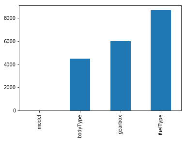


通过以上两句可以很直观的了解哪些列存在 “nan”, 并可以把nan的个数打印，主要的目的在于 nan存在的个数是否真的很大，如果很小一般选择填充，如果使用lgb等树模型可以直接空缺，让树自己去优化，但如果nan存在的过多、可以考虑删掉


```python
# 可视化看下缺省值
msno.matrix(Train_data.sample(250))
```


    <matplotlib.axes._subplots.AxesSubplot at 0x1a21139cc0>


```python
msno.bar(Train_data.sample(1000))
```


    <matplotlib.axes._subplots.AxesSubplot at 0x1a20cfde80>


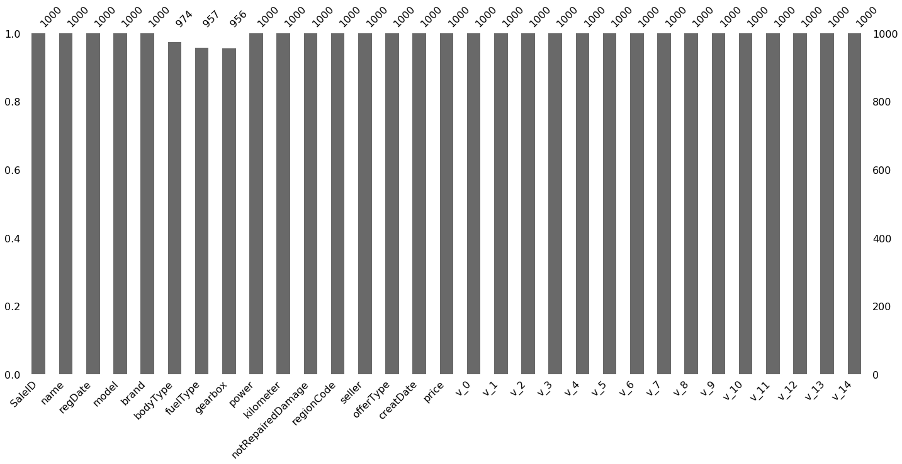


```python
# 可视化看下缺省值
msno.matrix(Test_data.sample(250))
```


    <matplotlib.axes._subplots.AxesSubplot at 0x1a21280f60>


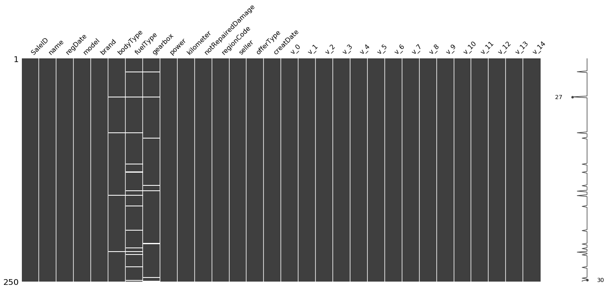


```python
msno.bar(Test_data.sample(1000))
```


    <matplotlib.axes._subplots.AxesSubplot at 0x1a2179ff98>


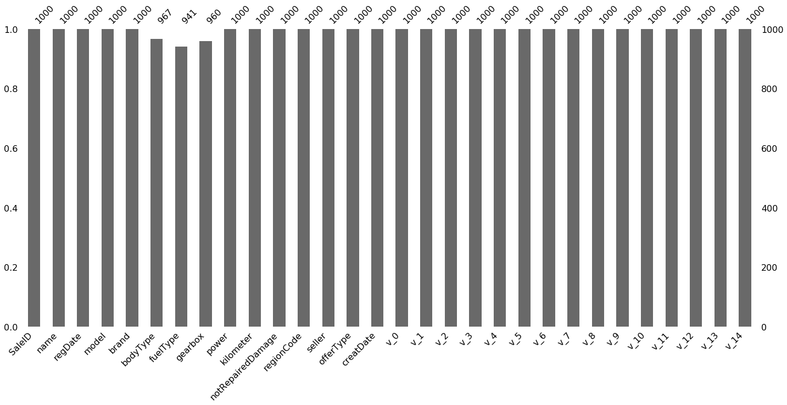


测试集的缺省和训练集的差不多情况, 可视化有四列有缺省，notRepairedDamage缺省得最多

## 2) 查看异常值检测


```python
Train_data.info()
```

    <class 'pandas.core.frame.DataFrame'>
    RangeIndex: 150000 entries, 0 to 149999
    Data columns (total 31 columns):
    SaleID               150000 non-null int64
    name                 150000 non-null int64
    regDate              150000 non-null int64
    model                149999 non-null float64
    brand                150000 non-null int64
    bodyType             145494 non-null float64
    fuelType             141320 non-null float64
    gearbox              144019 non-null float64
    power                150000 non-null int64
    kilometer            150000 non-null float64
    notRepairedDamage    150000 non-null object
    regionCode           150000 non-null int64
    seller               150000 non-null int64
    offerType            150000 non-null int64
    creatDate            150000 non-null int64
    price                150000 non-null int64
    v_0                  150000 non-null float64
    v_1                  150000 non-null float64
    v_2                  150000 non-null float64
    v_3                  150000 non-null float64
    v_4                  150000 non-null float64
    v_5                  150000 non-null float64
    v_6                  150000 non-null float64
    v_7                  150000 non-null float64
    v_8                  150000 non-null float64
    v_9                  150000 non-null float64
    v_10                 150000 non-null float64
    v_11                 150000 non-null float64
    v_12                 150000 non-null float64
    v_13                 150000 non-null float64
    v_14                 150000 non-null float64
    dtypes: float64(20), int64(10), object(1)
    memory usage: 35.5+ MB


可以发现除了notRepairedDamage 为object类型其他都为数字 这里我们把他的几个不同的值都进行显示就知道了


```python
Train_data['notRepairedDamage'].value_counts()
```


    0.0    111361
    -       24324
    1.0     14315
    Name: notRepairedDamage, dtype: int64


可以看出来‘ - ’也为空缺值，因为很多模型对nan有直接的处理，这里我们先不做处理，先替换成nan


```python
Train_data['notRepairedDamage'].replace('-', np.nan, inplace=True)
```


```python
Train_data['notRepairedDamage'].value_counts()
```


    0.0    111361
    1.0     14315
    Name: notRepairedDamage, dtype: int64


```python
Train_data.isnull().sum()
```


    SaleID                   0
    name                     0
    regDate                  0
    model                    1
    brand                    0
    bodyType              4506
    fuelType              8680
    gearbox               5981
    power                    0
    kilometer                0
    notRepairedDamage    24324
    regionCode               0
    seller                   0
    offerType                0
    creatDate                0
    price                    0
    v_0                      0
    v_1                      0
    v_2                      0
    v_3                      0
    v_4                      0
    v_5                      0
    v_6                      0
    v_7                      0
    v_8                      0
    v_9                      0
    v_10                     0
    v_11                     0
    v_12                     0
    v_13                     0
    v_14                     0
    dtype: int64


```python
Test_data['notRepairedDamage'].value_counts()
```


    0.0    37249
    -       8031
    1.0     4720
    Name: notRepairedDamage, dtype: int64


```python
Test_data['notRepairedDamage'].replace('-', np.nan, inplace=True)
```

以下两个类别特征严重倾斜，一般不会对预测有什么帮助，故这边先删掉，当然你也可以继续挖掘，但是一般意义不大


```python
Train_data["seller"].value_counts()
```


    0    149999
    1         1
    Name: seller, dtype: int64


```python
Train_data["offerType"].value_counts()
```


    0    150000
    Name: offerType, dtype: int64


```python
del Train_data["seller"]
del Train_data["offerType"]
del Test_data["seller"]
del Test_data["offerType"]
```

## 3.5 了解预测值的分布


```python
Train_data['price']
```


    0          1850
    1          3600
    2          6222
    3          2400
    4          5200
    5          8000
    6          3500
    7          1000
    8          2850
    9           650
    10         3100
    11         5450
    12         1600
    13         3100
    14         6900
    15         3200
    16        10500
    17         3700
    18          790
    19         1450
    20          990
    21         2800
    22          350
    23          599
    24         9250
    25         3650
    26         2800
    27         2399
    28         4900
    29         2999
              ...  
    149970      900
    149971     3400
    149972      999
    149973     3500
    149974     4500
    149975     3990
    149976     1200
    149977      330
    149978     3350
    149979     5000
    149980     4350
    149981     9000
    149982     2000
    149983    12000
    149984     6700
    149985     4200
    149986     2800
    149987     3000
    149988     7500
    149989     1150
    149990      450
    149991    24950
    149992      950
    149993     4399
    149994    14780
    149995     5900
    149996     9500
    149997     7500
    149998     4999
    149999     4700
    Name: price, Length: 150000, dtype: int64


```python
Train_data['price'].value_counts()
```


    500      2337
    1500     2158
    1200     1922
    1000     1850
    2500     1821
    600      1535
    3500     1533
    800      1513
    2000     1378
    999      1356
    750      1279
    4500     1271
    650      1257
    1800     1223
    2200     1201
    850      1198
    700      1174
    900      1107
    1300     1105
    950      1104
    3000     1098
    1100     1079
    5500     1079
    1600     1074
    300      1071
    550      1042
    350      1005
    1250     1003
    6500      973
    1999      929
             ... 
    21560       1
    7859        1
    3120        1
    2279        1
    6066        1
    6322        1
    4275        1
    10420       1
    43300       1
    305         1
    1765        1
    15970       1
    44400       1
    8885        1
    2992        1
    31850       1
    15413       1
    13495       1
    9525        1
    7270        1
    13879       1
    3760        1
    24250       1
    11360       1
    10295       1
    25321       1
    8886        1
    8801        1
    37920       1
    8188        1
    Name: price, Length: 3763, dtype: int64


```python
## 1) 总体分布概况（无界约翰逊分布等） 看看二车大盖都在什么价格
import scipy.stats as st
y = Train_data['price']
plt.figure(1); plt.title('Johnson SU')
sns.distplot(y, kde=False, fit=st.johnsonsu)
plt.figure(2); plt.title('Normal')
sns.distplot(y, kde=False, fit=st.norm)
plt.figure(3); plt.title('Log Normal')
sns.distplot(y, kde=False, fit=st.lognorm)
```


    <matplotlib.axes._subplots.AxesSubplot at 0x1a21fc4860>


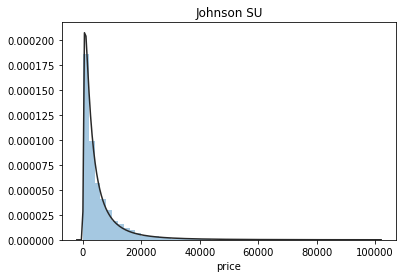


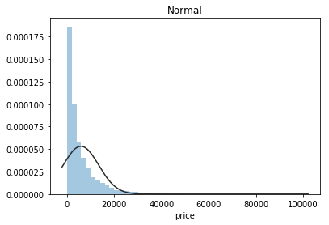


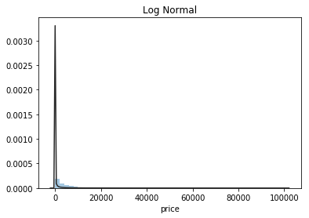


价格不服从正态分布，所以在进行回归之前，它必须进行转换。虽然对数变换做得很好，但最佳拟合是无界约翰逊分布
笔者这里对数据概率分布知识有点模糊了，后续需要找些知识补充

seaborn中的distplot主要功能是绘制单变量的直方图，且还可以在直方图的基础上施加kdeplot和rugplot的部分内容，是一个功能非常强大且实用的函数，其主要参数如下：

a：一维数组形式，传入待分析的单个变量

bins：int型变量，用于确定直方图中显示直方的数量，默认为None，这时bins的具体个数由Freedman-Diaconis准则来确定

hist：bool型变量，控制是否绘制直方图，默认为True

kde：bool型变量，控制是否绘制核密度估计曲线，默认为True

rug：bool型变量，控制是否绘制对应rugplot的部分，默认为False

fit：传入scipy.stats中的分布类型，用于在观察变量上抽取相关统计特征来强行拟合指定的分布，默认为None，即不进行拟合

hist_kws,kde_kws,rug_kws：这几个变量都接受字典形式的输入，键值对分别对应各自原生函数中的参数名称与参数值，在下文中会有示例

color：用于控制除了fit部分拟合出的曲线之外的所有对象的色彩

vertical：bool型，控制是否颠倒x-y轴，默认为False，即不颠倒

norm_hist：bool型变量，用于控制直方图高度代表的意义，为True直方图高度表示对应的密度，为False时代表的是对应的直方区间内记录值个数，默认为False

label：控制图像中的图例标签显示内容
图中的Johnson SU为约翰逊分布，是一种经过约翰变换后服从正态分布概率的随机变量的概率分布；normal为正态分布；lognormal为对数正态分布，对数正态分布从短期来看，与正态分布非常接近。但长期来看，对数正态分布向上分布的数值更多一些。

通过结果我们可以看到，无界约翰逊分布对price的分布情况拟合最好。


```python
## 2) 查看skewness and kurtosis
sns.distplot(Train_data['price']);
print("Skewness: %f" % Train_data['price'].skew())
print("Kurtosis: %f" % Train_data['price'].kurt())
```

    Skewness: 3.346487
    Kurtosis: 18.995183


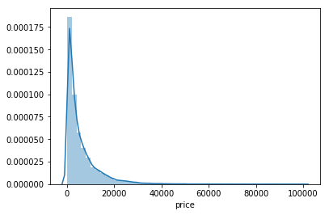


在这里计算了price的峰度和偏度

- 偏度（skewness）也称为偏态、偏态系数，是统计数据分布偏斜方向和程度的度量，是统计数据分布非对称程度的数字特征。
- 峰度（Kurtosis）与偏度类似，是描述总体中所有取值分布形态陡缓程度的统计量。这个统计量需要与正态分布相比较，峰度为0表示该总体数据分布与正态分布的陡缓程度相同；峰度大于0表示该总体数据分布与正态分布相比较为陡峭，为尖顶峰；峰度小于0表示该总体数据分布与正态分布相比较为平坦，为平顶峰。峰度的绝对值数值越大表示其分布形态的陡缓程度与正态分布的差异程度越大。
skew、kurt说明参考https://www.cnblogs.com/wyy1480/p/10474046.html


```python
Train_data.skew(), Train_data.kurt()
```


    (SaleID               6.017846e-17
     name                 5.576058e-01
     regDate              2.849508e-02
     model                1.484388e+00
     brand                1.150760e+00
     bodyType             9.915299e-01
     fuelType             1.595486e+00
     gearbox              1.317514e+00
     power                6.586318e+01
     kilometer           -1.525921e+00
     notRepairedDamage    2.430640e+00
     regionCode           6.888812e-01
     creatDate           -7.901331e+01
     price                3.346487e+00
     v_0                 -1.316712e+00
     v_1                  3.594543e-01
     v_2                  4.842556e+00
     v_3                  1.062920e-01
     v_4                  3.679890e-01
     v_5                 -4.737094e+00
     v_6                  3.680730e-01
     v_7                  5.130233e+00
     v_8                  2.046133e-01
     v_9                  4.195007e-01
     v_10                 2.522046e-02
     v_11                 3.029146e+00
     v_12                 3.653576e-01
     v_13                 2.679152e-01
     v_14                -1.186355e+00
     dtype: float64, SaleID                 -1.200000
     name                   -1.039945
     regDate                -0.697308
     model                   1.740483
     brand                   1.076201
     bodyType                0.206937
     fuelType                5.880049
     gearbox                -0.264161
     power                5733.451054
     kilometer               1.141934
     notRepairedDamage       3.908072
     regionCode             -0.340832
     creatDate            6881.080328
     price                  18.995183
     v_0                     3.993841
     v_1                    -1.753017
     v_2                    23.860591
     v_3                    -0.418006
     v_4                    -0.197295
     v_5                    22.934081
     v_6                    -1.742567
     v_7                    25.845489
     v_8                    -0.636225
     v_9                    -0.321491
     v_10                   -0.577935
     v_11                   12.568731
     v_12                    0.268937
     v_13                   -0.438274
     v_14                    2.393526
     dtype: float64)


```python
sns.distplot(Train_data.skew(),color='blue',axlabel ='Skewness')
```


    <matplotlib.axes._subplots.AxesSubplot at 0x1a20bd3668>


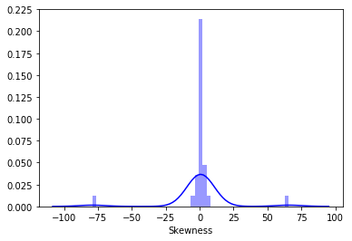


```python
sns.distplot(Train_data.kurt(),color='orange',axlabel ='Kurtness')
```


    <matplotlib.axes._subplots.AxesSubplot at 0x1a20b7fac8>


```python
## 3) 查看预测值的具体频数
plt.hist(Train_data['price'], orientation = 'vertical',histtype = 'bar', color ='red')
plt.show()
```


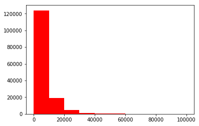


查看频数, 大于20000得值极少，其实这里也可以把这些当作特殊得值（异常值）直接用填充或者删掉，再前面进行


```python
# log变换 z之后的分布较均匀，可以进行log变换进行预测，这也是预测问题常用的trick
plt.hist(np.log(Train_data['price']), orientation = 'vertical',histtype = 'bar', color ='red') 
plt.show()
```


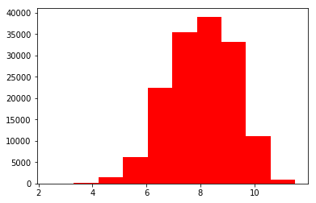


## 3.6 特征分为类别特征和数字特征，并对类别特征查看unique分布
回顾一下数据类型
**列**
* name - 汽车编码
* regDate - 汽车注册时间
* model - 车型编码
* brand - 品牌
* bodyType - 车身类型
* fuelType - 燃油类型
* gearbox - 变速箱
* power - 汽车功率
* kilometer - 汽车行驶公里
* notRepairedDamage - 汽车有尚未修复的损坏
* regionCode - 看车地区编码
* seller - 销售方 【以删】
* offerType - 报价类型 【以删】
* creatDate - 广告发布时间
* price - 汽车价格
* v_0', 'v_1', 'v_2', 'v_3', 'v_4', 'v_5', 'v_6', 'v_7', 'v_8', 'v_9', 'v_10', 'v_11', 'v_12', 'v_13','v_14'【匿名特征，包含v0-14在内15个匿名特征】


```python
# 分离label即预测值
Y_train = Train_data['price']
```


```python
# 这个区别方式适用于没有直接label coding的数据
# 这里不适用，需要人为根据实际含义来区分
# 数字特征
# numeric_features = Train_data.select_dtypes(include=[np.number])
# numeric_features.columns
# # 类型特征
# categorical_features = Train_data.select_dtypes(include=[np.object])
# categorical_features.columns
```


```python
numeric_features = ['power', 'kilometer', 'v_0', 'v_1', 'v_2', 'v_3', 'v_4', 'v_5', 'v_6', 'v_7', 'v_8', 'v_9', 'v_10', 'v_11', 'v_12', 'v_13','v_14' ]

categorical_features = ['name', 'model', 'brand', 'bodyType', 'fuelType', 'gearbox', 'notRepairedDamage', 'regionCode',]
```


```python
# 特征nunique分布
for cat_fea in categorical_features:
    print(cat_fea + "的特征分布如下：")
    print("{}特征有个{}不同的值".format(cat_fea, Train_data[cat_fea].nunique()))
    print(Train_data[cat_fea].value_counts())
```

    name的特征分布如下：
    name特征有个99662不同的值
    708       282
    387       282
    55        280
    1541      263
    203       233
    53        221
    713       217
    290       197
    1186      184
    911       182
    2044      176
    1513      160
    1180      158
    631       157
    893       153
    2765      147
    473       141
    1139      137
    1108      132
    444       129
    306       127
    2866      123
    2402      116
    533       114
    1479      113
    422       113
    4635      110
    725       110
    964       109
    1373      104
             ... 
    89083       1
    95230       1
    164864      1
    173060      1
    179207      1
    181256      1
    185354      1
    25564       1
    19417       1
    189324      1
    162719      1
    191373      1
    193422      1
    136082      1
    140180      1
    144278      1
    146327      1
    148376      1
    158621      1
    1404        1
    15319       1
    46022       1
    64463       1
    976         1
    3025        1
    5074        1
    7123        1
    11221       1
    13270       1
    174485      1
    Name: name, Length: 99662, dtype: int64
    model的特征分布如下：
    model特征有个248不同的值
    0.0      11762
    19.0      9573
    4.0       8445
    1.0       6038
    29.0      5186
    48.0      5052
    40.0      4502
    26.0      4496
    8.0       4391
    31.0      3827
    13.0      3762
    17.0      3121
    65.0      2730
    49.0      2608
    46.0      2454
    30.0      2342
    44.0      2195
    5.0       2063
    10.0      2004
    21.0      1872
    73.0      1789
    11.0      1775
    23.0      1696
    22.0      1524
    69.0      1522
    63.0      1469
    7.0       1460
    16.0      1349
    88.0      1309
    66.0      1250
             ...  
    141.0       37
    133.0       35
    216.0       30
    202.0       28
    151.0       26
    226.0       26
    231.0       23
    234.0       23
    233.0       20
    198.0       18
    224.0       18
    227.0       17
    237.0       17
    220.0       16
    230.0       16
    239.0       14
    223.0       13
    236.0       11
    241.0       10
    232.0       10
    229.0       10
    235.0        7
    246.0        7
    243.0        4
    244.0        3
    245.0        2
    209.0        2
    240.0        2
    242.0        2
    247.0        1
    Name: model, Length: 248, dtype: int64
    brand的特征分布如下：
    brand特征有个40不同的值
    0     31480
    4     16737
    14    16089
    10    14249
    1     13794
    6     10217
    9      7306
    5      4665
    13     3817
    11     2945
    3      2461
    7      2361
    16     2223
    8      2077
    25     2064
    27     2053
    21     1547
    15     1458
    19     1388
    20     1236
    12     1109
    22     1085
    26      966
    30      940
    17      913
    24      772
    28      649
    32      592
    29      406
    37      333
    2       321
    31      318
    18      316
    36      228
    34      227
    33      218
    23      186
    35      180
    38       65
    39        9
    Name: brand, dtype: int64
    bodyType的特征分布如下：
    bodyType特征有个8不同的值
    0.0    41420
    1.0    35272
    2.0    30324
    3.0    13491
    4.0     9609
    5.0     7607
    6.0     6482
    7.0     1289
    Name: bodyType, dtype: int64
    fuelType的特征分布如下：
    fuelType特征有个7不同的值
    0.0    91656
    1.0    46991
    2.0     2212
    3.0      262
    4.0      118
    5.0       45
    6.0       36
    Name: fuelType, dtype: int64
    gearbox的特征分布如下：
    gearbox特征有个2不同的值
    0.0    111623
    1.0     32396
    Name: gearbox, dtype: int64
    notRepairedDamage的特征分布如下：
    notRepairedDamage特征有个2不同的值
    0.0    111361
    1.0     14315
    Name: notRepairedDamage, dtype: int64
    regionCode的特征分布如下：
    regionCode特征有个7905不同的值
    419     369
    764     258
    125     137
    176     136
    462     134
    428     132
    24      130
    1184    130
    122     129
    828     126
    70      125
    827     120
    207     118
    1222    117
    2418    117
    85      116
    2615    115
    2222    113
    759     112
    188     111
    1757    110
    1157    109
    2401    107
    1069    107
    3545    107
    424     107
    272     107
    451     106
    450     105
    129     105
           ... 
    6324      1
    7372      1
    7500      1
    8107      1
    2453      1
    7942      1
    5135      1
    6760      1
    8070      1
    7220      1
    8041      1
    8012      1
    5965      1
    823       1
    7401      1
    8106      1
    5224      1
    8117      1
    7507      1
    7989      1
    6505      1
    6377      1
    8042      1
    7763      1
    7786      1
    6414      1
    7063      1
    4239      1
    5931      1
    7267      1
    Name: regionCode, Length: 7905, dtype: int64


```python
# 特征nunique分布
for cat_fea in categorical_features:
    print(cat_fea + "的特征分布如下：")
    print("{}特征有个{}不同的值".format(cat_fea, Test_data[cat_fea].nunique()))
    print(Test_data[cat_fea].value_counts())
```

    name的特征分布如下：
    name特征有个37453不同的值
    55        97
    708       96
    387       95
    1541      88
    713       74
    53        72
    1186      67
    203       67
    631       65
    911       64
    2044      62
    2866      60
    1139      57
    893       54
    1180      52
    2765      50
    1108      50
    290       48
    1513      47
    691       45
    473       44
    299       43
    444       41
    422       39
    964       39
    1479      38
    1273      38
    306       36
    725       35
    4635      35
              ..
    46786      1
    48835      1
    165572     1
    68204      1
    171719     1
    59080      1
    186062     1
    11985      1
    147155     1
    134869     1
    138967     1
    173792     1
    114403     1
    59098      1
    59144      1
    40679      1
    61161      1
    128746     1
    55022      1
    143089     1
    14066      1
    147187     1
    112892     1
    46598      1
    159481     1
    22270      1
    89855      1
    42752      1
    48899      1
    11808      1
    Name: name, Length: 37453, dtype: int64
    model的特征分布如下：
    model特征有个247不同的值
    0.0      3896
    19.0     3245
    4.0      3007
    1.0      1981
    29.0     1742
    48.0     1685
    26.0     1525
    40.0     1409
    8.0      1397
    31.0     1292
    13.0     1210
    17.0     1087
    65.0      915
    49.0      866
    46.0      831
    30.0      803
    10.0      709
    5.0       696
    44.0      676
    21.0      659
    11.0      603
    23.0      591
    73.0      561
    69.0      555
    7.0       526
    63.0      493
    22.0      443
    16.0      412
    66.0      411
    88.0      391
             ... 
    124.0       9
    193.0       9
    151.0       8
    198.0       8
    181.0       8
    239.0       7
    233.0       7
    216.0       7
    231.0       6
    133.0       6
    236.0       6
    227.0       6
    220.0       5
    230.0       5
    234.0       4
    224.0       4
    241.0       4
    223.0       4
    229.0       3
    189.0       3
    232.0       3
    237.0       3
    235.0       2
    245.0       2
    209.0       2
    242.0       1
    240.0       1
    244.0       1
    243.0       1
    246.0       1
    Name: model, Length: 247, dtype: int64
    brand的特征分布如下：
    brand特征有个40不同的值
    0     10348
    4      5763
    14     5314
    10     4766
    1      4532
    6      3502
    9      2423
    5      1569
    13     1245
    11      919
    7       795
    3       773
    16      771
    8       704
    25      695
    27      650
    21      544
    15      511
    20      450
    19      450
    12      389
    22      363
    30      324
    17      317
    26      303
    24      268
    28      225
    32      193
    29      117
    31      115
    18      106
    2       104
    37       92
    34       77
    33       76
    36       67
    23       62
    35       53
    38       23
    39        2
    Name: brand, dtype: int64
    bodyType的特征分布如下：
    bodyType特征有个8不同的值
    0.0    13985
    1.0    11882
    2.0     9900
    3.0     4433
    4.0     3303
    5.0     2537
    6.0     2116
    7.0      431
    Name: bodyType, dtype: int64
    fuelType的特征分布如下：
    fuelType特征有个7不同的值
    0.0    30656
    1.0    15544
    2.0      774
    3.0       72
    4.0       37
    6.0       14
    5.0       10
    Name: fuelType, dtype: int64
    gearbox的特征分布如下：
    gearbox特征有个2不同的值
    0.0    37301
    1.0    10789
    Name: gearbox, dtype: int64
    notRepairedDamage的特征分布如下：
    notRepairedDamage特征有个2不同的值
    0.0    37249
    1.0     4720
    Name: notRepairedDamage, dtype: int64
    regionCode的特征分布如下：
    regionCode特征有个6971不同的值
    419     146
    764      78
    188      52
    125      51
    759      51
    2615     50
    462      49
    542      44
    85       44
    1069     43
    451      41
    828      40
    757      39
    1688     39
    2154     39
    1947     39
    24       39
    2690     38
    238      38
    2418     38
    827      38
    1184     38
    272      38
    233      38
    70       37
    703      37
    2067     37
    509      37
    360      37
    176      37
           ... 
    5512      1
    7465      1
    1290      1
    3717      1
    1258      1
    7401      1
    7920      1
    7925      1
    5151      1
    7527      1
    7689      1
    8114      1
    3237      1
    6003      1
    7335      1
    3984      1
    7367      1
    6001      1
    8021      1
    3691      1
    4920      1
    6035      1
    3333      1
    5382      1
    6969      1
    7753      1
    7463      1
    7230      1
    826       1
    112       1
    Name: regionCode, Length: 6971, dtype: int64


```python
numeric_features.append('price')
```


```python
numeric_features
```


    ['power',
     'kilometer',
     'v_0',
     'v_1',
     'v_2',
     'v_3',
     'v_4',
     'v_5',
     'v_6',
     'v_7',
     'v_8',
     'v_9',
     'v_10',
     'v_11',
     'v_12',
     'v_13',
     'v_14',
     'price']


```python
Train_data.head()
```


<div>
<style scoped>
    .dataframe tbody tr th:only-of-type {
        vertical-align: middle;
    }

    .dataframe tbody tr th {
        vertical-align: top;
    }

    .dataframe thead th {
        text-align: right;
    }
</style>
<table border="1" class="dataframe">
  <thead>
    <tr style="text-align: right;">
      <th></th>
      <th>SaleID</th>
      <th>name</th>
      <th>regDate</th>
      <th>model</th>
      <th>brand</th>
      <th>bodyType</th>
      <th>fuelType</th>
      <th>gearbox</th>
      <th>power</th>
      <th>kilometer</th>
      <th>...</th>
      <th>v_5</th>
      <th>v_6</th>
      <th>v_7</th>
      <th>v_8</th>
      <th>v_9</th>
      <th>v_10</th>
      <th>v_11</th>
      <th>v_12</th>
      <th>v_13</th>
      <th>v_14</th>
    </tr>
  </thead>
  <tbody>
    <tr>
      <th>0</th>
      <td>0</td>
      <td>736</td>
      <td>20040402</td>
      <td>30.0</td>
      <td>6</td>
      <td>1.0</td>
      <td>0.0</td>
      <td>0.0</td>
      <td>60</td>
      <td>12.5</td>
      <td>...</td>
      <td>0.235676</td>
      <td>0.101988</td>
      <td>0.129549</td>
      <td>0.022816</td>
      <td>0.097462</td>
      <td>-2.881803</td>
      <td>2.804097</td>
      <td>-2.420821</td>
      <td>0.795292</td>
      <td>0.914762</td>
    </tr>
    <tr>
      <th>1</th>
      <td>1</td>
      <td>2262</td>
      <td>20030301</td>
      <td>40.0</td>
      <td>1</td>
      <td>2.0</td>
      <td>0.0</td>
      <td>0.0</td>
      <td>0</td>
      <td>15.0</td>
      <td>...</td>
      <td>0.264777</td>
      <td>0.121004</td>
      <td>0.135731</td>
      <td>0.026597</td>
      <td>0.020582</td>
      <td>-4.900482</td>
      <td>2.096338</td>
      <td>-1.030483</td>
      <td>-1.722674</td>
      <td>0.245522</td>
    </tr>
    <tr>
      <th>2</th>
      <td>2</td>
      <td>14874</td>
      <td>20040403</td>
      <td>115.0</td>
      <td>15</td>
      <td>1.0</td>
      <td>0.0</td>
      <td>0.0</td>
      <td>163</td>
      <td>12.5</td>
      <td>...</td>
      <td>0.251410</td>
      <td>0.114912</td>
      <td>0.165147</td>
      <td>0.062173</td>
      <td>0.027075</td>
      <td>-4.846749</td>
      <td>1.803559</td>
      <td>1.565330</td>
      <td>-0.832687</td>
      <td>-0.229963</td>
    </tr>
    <tr>
      <th>3</th>
      <td>3</td>
      <td>71865</td>
      <td>19960908</td>
      <td>109.0</td>
      <td>10</td>
      <td>0.0</td>
      <td>0.0</td>
      <td>1.0</td>
      <td>193</td>
      <td>15.0</td>
      <td>...</td>
      <td>0.274293</td>
      <td>0.110300</td>
      <td>0.121964</td>
      <td>0.033395</td>
      <td>0.000000</td>
      <td>-4.509599</td>
      <td>1.285940</td>
      <td>-0.501868</td>
      <td>-2.438353</td>
      <td>-0.478699</td>
    </tr>
    <tr>
      <th>4</th>
      <td>4</td>
      <td>111080</td>
      <td>20120103</td>
      <td>110.0</td>
      <td>5</td>
      <td>1.0</td>
      <td>0.0</td>
      <td>0.0</td>
      <td>68</td>
      <td>5.0</td>
      <td>...</td>
      <td>0.228036</td>
      <td>0.073205</td>
      <td>0.091880</td>
      <td>0.078819</td>
      <td>0.121534</td>
      <td>-1.896240</td>
      <td>0.910783</td>
      <td>0.931110</td>
      <td>2.834518</td>
      <td>1.923482</td>
    </tr>
  </tbody>
</table>
<p>5 rows × 29 columns</p>
</div>


```python
## 1) 相关性分析 即计算矩阵相关性系数
price_numeric = Train_data[numeric_features]
correlation = price_numeric.corr()
print(correlation['price'].sort_values(ascending = False),'\n')
```

    price        1.000000
    v_12         0.692823
    v_8          0.685798
    v_0          0.628397
    power        0.219834
    v_5          0.164317
    v_2          0.085322
    v_6          0.068970
    v_1          0.060914
    v_14         0.035911
    v_13        -0.013993
    v_7         -0.053024
    v_4         -0.147085
    v_9         -0.206205
    v_10        -0.246175
    v_11        -0.275320
    kilometer   -0.440519
    v_3         -0.730946
    Name: price, dtype: float64 
    


```python
f , ax = plt.subplots(figsize = (7, 7))

plt.title('Correlation of Numeric Features with Price',y=1,size=16)

sns.heatmap(correlation,square = True,  vmax=0.8)
# 相关分析，热度图heatmaps1
```


    <matplotlib.axes._subplots.AxesSubplot at 0x1a2e55f588>


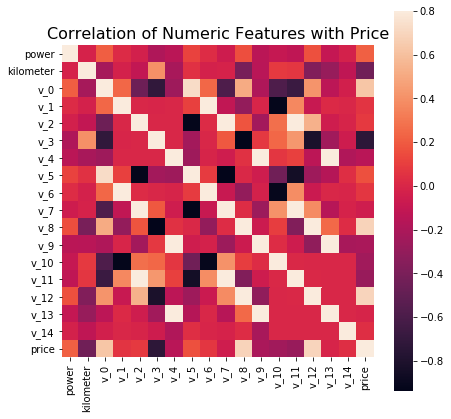


```python
del price_numeric['price']
```


```python
## 2) 查看几个特征得 偏度和峰值
for col in numeric_features:
    print('{:15}'.format(col), 
          'Skewness: {:05.2f}'.format(Train_data[col].skew()) , 
          '   ' ,
          'Kurtosis: {:06.2f}'.format(Train_data[col].kurt())  
         )
```

    power           Skewness: 65.86     Kurtosis: 5733.45
    kilometer       Skewness: -1.53     Kurtosis: 001.14
    v_0             Skewness: -1.32     Kurtosis: 003.99
    v_1             Skewness: 00.36     Kurtosis: -01.75
    v_2             Skewness: 04.84     Kurtosis: 023.86
    v_3             Skewness: 00.11     Kurtosis: -00.42
    v_4             Skewness: 00.37     Kurtosis: -00.20
    v_5             Skewness: -4.74     Kurtosis: 022.93
    v_6             Skewness: 00.37     Kurtosis: -01.74
    v_7             Skewness: 05.13     Kurtosis: 025.85
    v_8             Skewness: 00.20     Kurtosis: -00.64
    v_9             Skewness: 00.42     Kurtosis: -00.32
    v_10            Skewness: 00.03     Kurtosis: -00.58
    v_11            Skewness: 03.03     Kurtosis: 012.57
    v_12            Skewness: 00.37     Kurtosis: 000.27
    v_13            Skewness: 00.27     Kurtosis: -00.44
    v_14            Skewness: -1.19     Kurtosis: 002.39
    price           Skewness: 03.35     Kurtosis: 019.00


```python
## 3) 每个数字特征得分布可视化
f = pd.melt(Train_data, value_vars=numeric_features)
g = sns.FacetGrid(f, col="variable",  col_wrap=2, sharex=False, sharey=False)
g = g.map(sns.distplot, "value")
```


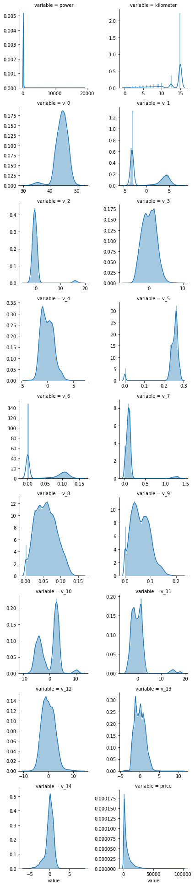


每个数字特征的分布可视化
使用melt()函数将列名转换成列数据
再使用FaceGrid和map绘制出每个属性的分布图


```python
## 4) 数字特征相互之间的关系可视化
## 使用paiplot展示两两属性之间的关系，对角线是单个属性的分布图
sns.set()
columns = ['price', 'v_12', 'v_8' , 'v_0', 'power', 'v_5',  'v_2', 'v_6', 'v_1', 'v_14']
sns.pairplot(Train_data[columns],size = 2 ,kind ='scatter',diag_kind='kde')
plt.show()
```


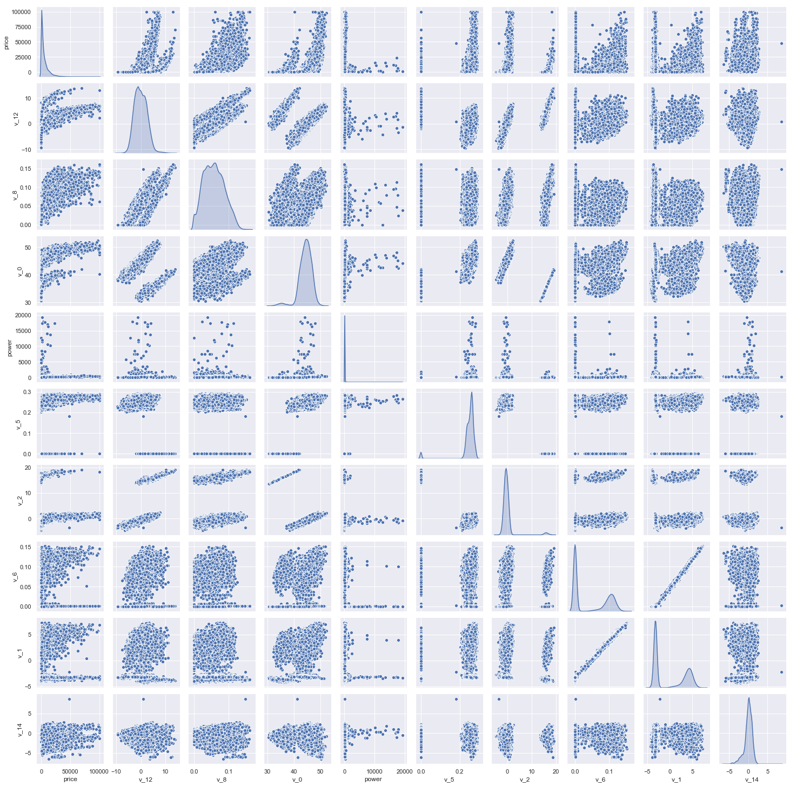


```python
Train_data.columns
```


```python
Y_train
```


```python
#### 此处是多变量之间的关系可视化，可视化更多学习可参考很不错的文章 https://www.jianshu.com/p/6e18d21a4cad
```


```python
## 5) 多变量互相回归关系可视化
fig, ((ax1, ax2), (ax3, ax4), (ax5, ax6), (ax7, ax8), (ax9, ax10)) = plt.subplots(nrows=5, ncols=2, figsize=(24, 20))
# ['v_12', 'v_8' , 'v_0', 'power', 'v_5',  'v_2', 'v_6', 'v_1', 'v_14']
v_12_scatter_plot = pd.concat([Y_train,Train_data['v_12']],axis = 1)
sns.regplot(x='v_12',y = 'price', data = v_12_scatter_plot,scatter= True, fit_reg=True, ax=ax1)

v_8_scatter_plot = pd.concat([Y_train,Train_data['v_8']],axis = 1)
sns.regplot(x='v_8',y = 'price',data = v_8_scatter_plot,scatter= True, fit_reg=True, ax=ax2)

v_0_scatter_plot = pd.concat([Y_train,Train_data['v_0']],axis = 1)
sns.regplot(x='v_0',y = 'price',data = v_0_scatter_plot,scatter= True, fit_reg=True, ax=ax3)

power_scatter_plot = pd.concat([Y_train,Train_data['power']],axis = 1)
sns.regplot(x='power',y = 'price',data = power_scatter_plot,scatter= True, fit_reg=True, ax=ax4)

v_5_scatter_plot = pd.concat([Y_train,Train_data['v_5']],axis = 1)
sns.regplot(x='v_5',y = 'price',data = v_5_scatter_plot,scatter= True, fit_reg=True, ax=ax5)

v_2_scatter_plot = pd.concat([Y_train,Train_data['v_2']],axis = 1)
sns.regplot(x='v_2',y = 'price',data = v_2_scatter_plot,scatter= True, fit_reg=True, ax=ax6)

v_6_scatter_plot = pd.concat([Y_train,Train_data['v_6']],axis = 1)
sns.regplot(x='v_6',y = 'price',data = v_6_scatter_plot,scatter= True, fit_reg=True, ax=ax7)

v_1_scatter_plot = pd.concat([Y_train,Train_data['v_1']],axis = 1)
sns.regplot(x='v_1',y = 'price',data = v_1_scatter_plot,scatter= True, fit_reg=True, ax=ax8)

v_14_scatter_plot = pd.concat([Y_train,Train_data['v_14']],axis = 1)
sns.regplot(x='v_14',y = 'price',data = v_14_scatter_plot,scatter= True, fit_reg=True, ax=ax9)

v_13_scatter_plot = pd.concat([Y_train,Train_data['v_13']],axis = 1)
sns.regplot(x='v_13',y = 'price',data = v_13_scatter_plot,scatter= True, fit_reg=True, ax=ax10)

```


    <matplotlib.axes._subplots.AxesSubplot at 0x1a2b8fd8d0>


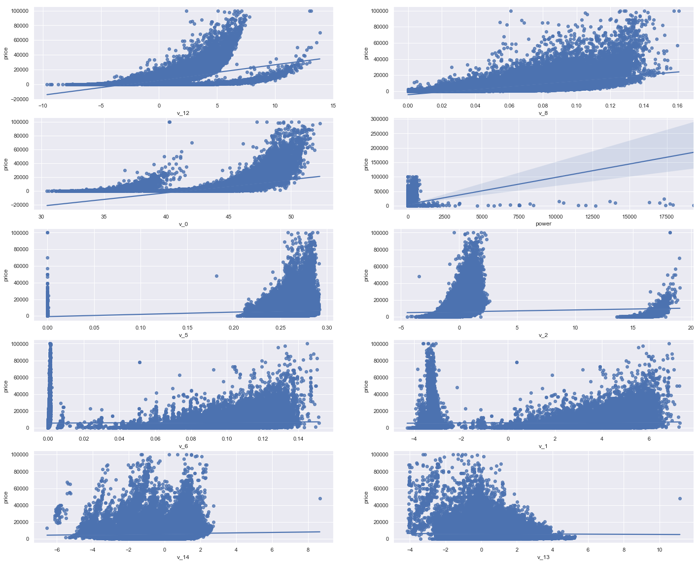


```python
## 3.8 类别特征分析
    - unique分布
    - 类别特征箱形图可视化
    - 类别特征的小提琴图可视化
    - 类别特征的柱形图可视化类别
    - 特征的每个类别频数可视化(count_plot)
```


```python
## 1) unique分布
for fea in categorical_features:
    print(Train_data[fea].nunique())
```

    99662
    248
    40
    8
    7
    2
    2
    7905


```python
categorical_features
```


    ['name',
     'model',
     'brand',
     'bodyType',
     'fuelType',
     'gearbox',
     'notRepairedDamage',
     'regionCode']


```python
## 2) 类别特征箱形图可视化

# 因为 name和 regionCode的类别太稀疏了，这里我们把不稀疏的几类画一下
categorical_features = ['model',
 'brand',
 'bodyType',
 'fuelType',
 'gearbox',
 'notRepairedDamage']
for c in categorical_features:
    Train_data[c] = Train_data[c].astype('category')
    if Train_data[c].isnull().any():
        Train_data[c] = Train_data[c].cat.add_categories(['MISSING'])
        Train_data[c] = Train_data[c].fillna('MISSING')

def boxplot(x, y, **kwargs):
    sns.boxplot(x=x, y=y)
    x=plt.xticks(rotation=90)

f = pd.melt(Train_data, id_vars=['price'], value_vars=categorical_features)
g = sns.FacetGrid(f, col="variable",  col_wrap=2, sharex=False, sharey=False, size=5)
g = g.map(boxplot, "value", "price")
```


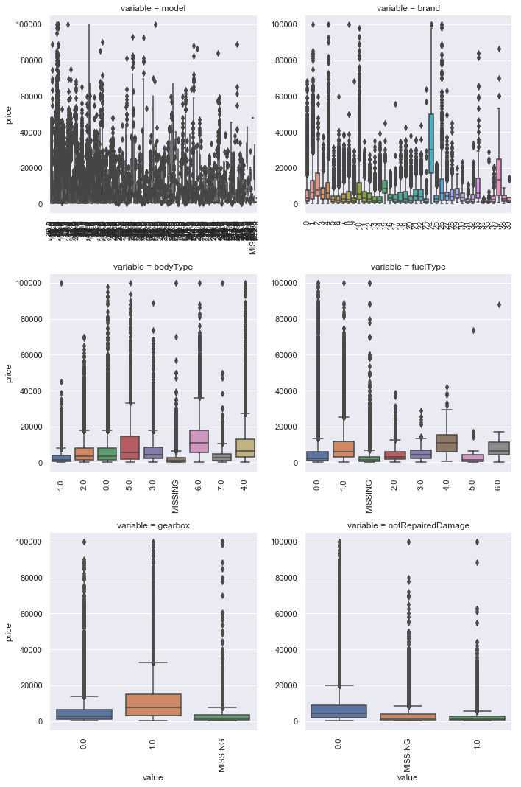


箱形图国内的同学们可能不太熟悉，我也是当初学GRE数学的时候才了解到这个东东 https://baike.baidu.com/item/%E7%AE%B1%E5%BD%A2%E5%9B%BE/10671164?fr=aladdin


```python
Train_data.columns
```


    Index(['SaleID', 'name', 'regDate', 'model', 'brand', 'bodyType', 'fuelType',
           'gearbox', 'power', 'kilometer', 'notRepairedDamage', 'regionCode',
           'creatDate', 'price', 'v_0', 'v_1', 'v_2', 'v_3', 'v_4', 'v_5', 'v_6',
           'v_7', 'v_8', 'v_9', 'v_10', 'v_11', 'v_12', 'v_13', 'v_14'],
          dtype='object')


```python
## 3) 类别特征的小提琴图可视化
catg_list = categorical_features
target = 'price'
for catg in catg_list :
    sns.violinplot(x=catg, y=target, data=Train_data)
    plt.show()
```


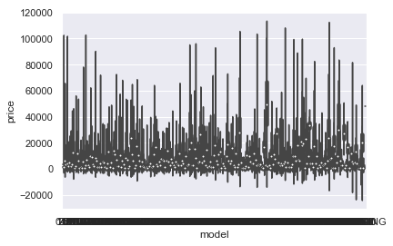


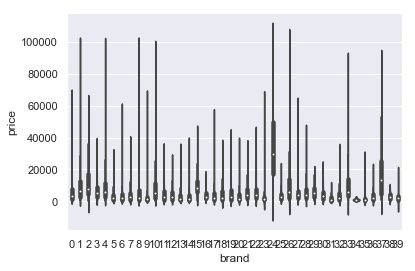


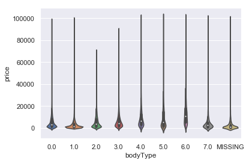


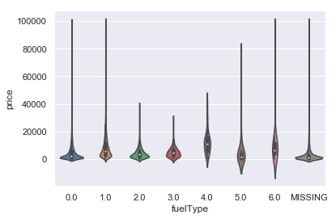


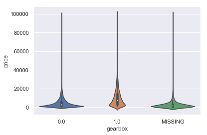


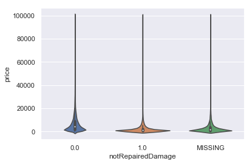


小提琴图和箱形图是可以参考https://www.cnblogs.com/zhhfan/p/11344310.html


```python
categorical_features = ['model',
 'brand',
 'bodyType',
 'fuelType',
 'gearbox',
 'notRepairedDamage']
```


```python
## 4) 类别特征的柱形图可视化
def bar_plot(x, y, **kwargs):
    sns.barplot(x=x, y=y)
    x=plt.xticks(rotation=90)

f = pd.melt(Train_data, id_vars=['price'], value_vars=categorical_features)
g = sns.FacetGrid(f, col="variable",  col_wrap=2, sharex=False, sharey=False, size=5)
g = g.map(bar_plot, "value", "price")
```


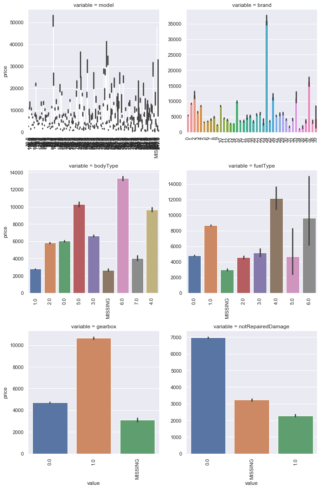


```python
##  5) 类别特征的每个类别频数可视化(count_plot)
def count_plot(x,  **kwargs):
    sns.countplot(x=x)
    x=plt.xticks(rotation=90)

f = pd.melt(Train_data,  value_vars=categorical_features)
g = sns.FacetGrid(f, col="variable",  col_wrap=2, sharex=False, sharey=False, size=5)
g = g.map(count_plot, "value")

```


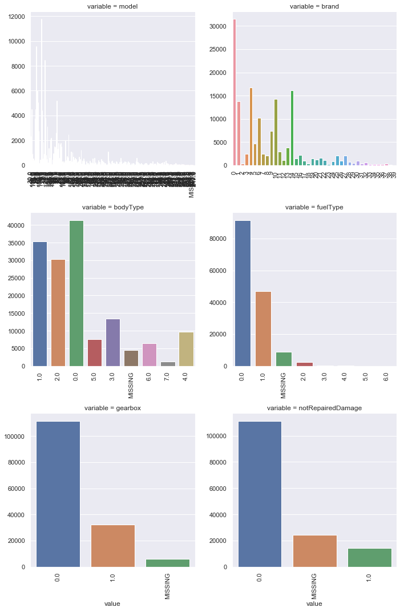


## 3.9 用pandas_profiling生成数据报告
用pandas_profiling生成一个较为全面的可视化和数据报告(较为简单、方便) 最终打开html文件即可


```python
import pandas_profiling
pfr = pandas_profiling.ProfileReport(Train_data)
pfr.to_file("./example.html")
```

# 4 经验总结

所给出的EDA步骤为广为普遍的步骤，在实际的不管是工程还是比赛过程中，这只是最开始的一步，也是最基本的一步。

接下来一般要结合模型的效果以及特征工程等来分析数据的实际建模情况，根据自己的一些理解，查阅文献，对实际问题做出判断和深入的理解。

最后不断进行EDA与数据处理和挖掘，来到达更好的数据结构和分布以及较为强势相关的特征

---
数据探索在机器学习中我们一般称为EDA（Exploratory Data Analysis）：

> 是指对已有的数据（特别是调查或观察得来的原始数据）在尽量少的先验假定下进行探索，通过作图、制表、方程拟合、计算特征量等手段探索数据的结构和规律的一种数据分析方法。

数据探索有利于我们发现数据的一些特性，数据之间的关联性，对于后续的特征构建是很有帮助的。

1. 对于数据的初步分析（直接查看数据，或.sum(), .mean()，.descirbe()等统计函数）可以从：样本数量，训练集数量，是否有时间特征，是否是时许问题，特征所表示的含义（非匿名特征），特征类型（字符类似，int，float，time），特征的缺失情况（注意缺失的在数据中的表现形式，有些是空的有些是”NAN”符号等），特征的均值方差情况。

2. 分析记录某些特征值缺失占比30%以上样本的缺失处理，有助于后续的模型验证和调节，分析特征应该是填充（填充方式是什么，均值填充，0填充，众数填充等），还是舍去，还是先做样本分类用不同的特征模型去预测。

3. 对于异常值做专门的分析，分析特征异常的label是否为异常值（或者偏离均值较远或者事特殊符号）,异常值是否应该剔除，还是用正常值填充，是记录异常，还是机器本身异常等。

4. 对于Label做专门的分析，分析标签的分布情况等。

5. 进步分析可以通过对特征作图，特征和label联合做图（统计图，离散图），直观了解特征的分布情况，通过这一步也可以发现数据之中的一些异常值等，通过箱型图分析一些特征值的偏离情况，对于特征和特征联合作图，对于特征和label联合作图，分析其中的一些关联性。


```python
# END.参考文档
1.[数据探索性分析（EDA）](https://blog.csdn.net/weixin_42297855/article/details/97501680)
```
